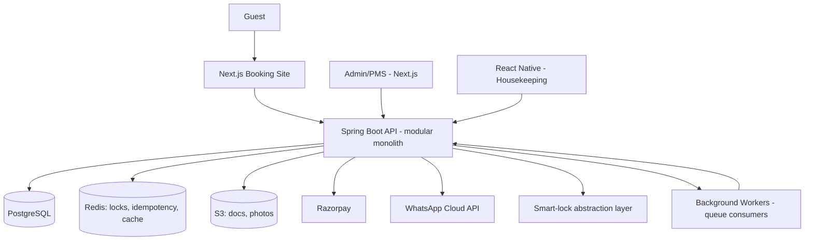
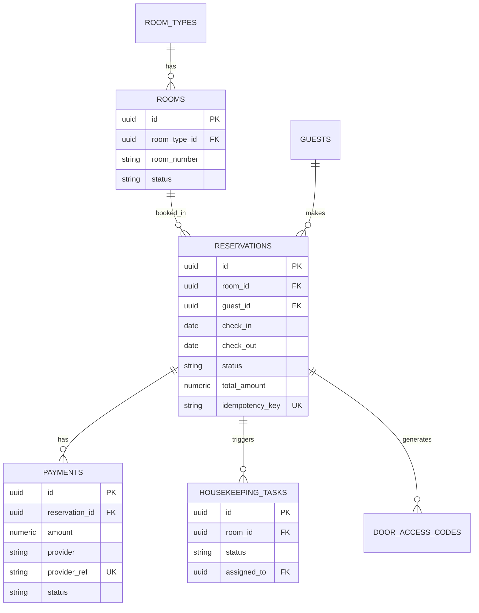

# Architecture — StayOS

## 1. Stack and rationale

| Layer | Choice | Why |
|---|---|---|
| Frontend (guest + admin) | Next.js 14 + TypeScript + Tailwind | SSR for SEO landing pages; one framework for both apps |
| Staff mobile (housekeeping) | React Native | Native push + camera (room photos) beats a PWA |
| Backend | Spring Boot (Java), modular monolith | Strong transactional/ACID guarantees for payments and booking locks; matches existing team expertise |
| Database | PostgreSQL | Single source of truth; row-level/exclusion-constraint locking for availability |
| Cache/queue | Redis (+ Spring `@Async`/Quartz, or RabbitMQ if volume grows) | Idempotency keys, rate limiting, job scheduling |
| Auth | Auth0 | OTP, RBAC, MFA for admins, out of the box |
| Realtime | Socket.IO or Spring WebSocket | Live PMS dashboard, housekeeping status |
| Storage | S3-compatible (AWS S3 / Cloudflare R2) | ID docs, room photos |
| Infra | AWS (RDS Postgres, ECS/Fargate, S3, CloudFront), ap-south-1 | India latency, mature ecosystem |
| Payments | Razorpay primary, Stripe later | UPI/wallets/netbanking native to India |
| Messaging | WhatsApp Cloud API (Meta) | Official API required for business messaging at scale |

**Trade-off called out explicitly:** modular monolith (single Spring Boot app,
package-per-module) over microservices — right-sized for a 20-room property.
Split a module into its own service later only if its load genuinely diverges
(e.g. the pricing engine).

## 2. High-level architecture



Modules inside the monolith: `booking`, `payments`, `guests`, `pms`,
`housekeeping`, `pricing`, `whatsapp`, `notifications`, `expenses`,
`reviews`, `loyalty`, `audit`.

## 3. Database (core entities)



Full schema (users, roles, permissions, rate_plans, availability, guest_documents,
refunds, invoices, taxes, coupons, loyalty_accounts, loyalty_transactions,
referral_codes, maintenance_tasks, staff, expenses, utility_readings,
smart_devices, messages, whatsapp_conversations, notifications, reviews,
pricing_rules, competitor_prices, audit_logs) was scoped conceptually but not
yet fully specified field-by-field — expand this section before Phase 1
implementation.

**Availability locking:** a Postgres exclusion constraint on
`(room_id, daterange(check_in, check_out))` prevents double-booking at the DB
level. No application-level locking is needed or should be added.

## 4. Booking state machine

`PENDING → PAYMENT_PROCESSING → CONFIRMED → CHECKED_IN → CHECKED_OUT`

Branches: `PAYMENT_FAILED → PENDING` (retry) · `CONFIRMED → CANCELLED`
(triggers refund flow) · `CONFIRMED → NO_SHOW`.

**Payments:** a Razorpay order is created, then a signature-verified webhook
is the only path to `CONFIRMED` — the client-side success callback is never
trusted. Idempotency key = `reservation_id + attempt_no`.

## 5. WhatsApp AI — tool contract

The agent must never invent availability, prices, or booking status. It can
only answer via these tools, each of which hits the real `booking`/`pms`
modules:

- `get_availability(dates, room_type)`
- `get_price(dates, room_type)`
- `create_reservation(...)`
- `get_reservation_status(id)`
- `cancel_reservation(id)`
- `get_checkin_info(reservation_id)`
- `escalate_to_human(reason)`

## 6. Smart-lock abstraction

```
interface LockProvider {
  generateAccessCode(roomId, validFrom, validTo): Code
  revokeAccessCode(codeId): void
  getLockStatus(roomId): Status
}
```

Vendor-specific adapters (whichever lock brand is chosen) implement this
interface; the PMS never calls a vendor SDK directly. If the lock API fails,
front desk gets an alert plus a manual code override path. See the migrated
code file for a concrete Java version of this interface.

## 7. Dynamic pricing (transparent formula)

```
Price = BaseRate × OccupancyMultiplier × LeadTimeMultiplier × EventMultiplier
```

Clamped to `[floor, ceiling]`. Every recalculation writes a `pricing_rules`
audit row (old price, new price, inputs, actor = system or manual). A manual
override always wins and requires GM approval above a configurable deviation
threshold.

## 8. Security & reliability

- Auth0 for auth; MFA required for admin/owner roles; RBAC enforced
  server-side on every endpoint, not just in the UI.
- Webhooks (Razorpay, WhatsApp): verify signatures, dedupe by `provider_ref`,
  process via a queue with retry + dead-letter queue.
- No raw card data is ever stored — Razorpay tokenizes.
- Guest ID documents: encrypted at rest (S3 SSE), access logged, retained
  only for a configurable period then purged.
- All financial writes happen inside DB transactions and write to
  `audit_logs`.
- Failure fallbacks: payment provider down → reservation stays `PENDING`,
  guest notified, staff alerted. WhatsApp down → fall back to SMS/email queue.

## 9. Infra cost assumptions (20 rooms, MVP)

AWS RDS (small) + ECS Fargate (1–2 tasks) + S3 + CloudFront ≈ $60–150/mo.
Auth0 free tier covers this scale. Razorpay is per-transaction (no fixed
fee). WhatsApp Cloud API is priced per-conversation-category — check Meta's
current rates before budgeting. Assumes low traffic, single property.

## Gaps to close before implementation

- Full field-level schema for every table listed in section 3.
- REST API specification (methods, request/response shapes, auth per
  endpoint) — not yet drafted.
- Frontend route/component structure for the Next.js apps — not yet drafted.
- Observability/testing stack selection — discussed only at the principle
  level, no specific tools chosen yet.
